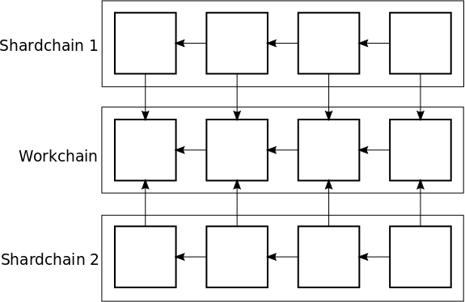

# The Chainspace Open Smart Contracts Platform

## Smart contract execution model

### Authentication
A Chainspace address is a Secp256k1 public key.

## Core blockchain consensus
The Chainspace platform relies on a core proof-of-work blockchain, which is used to define a stake mapping in a proof-of-stake style system to randomly map nodes to shards, weighted by their relative stakes.

We define two types of chains. The workchain, of which only one exists, and shardchains, of which one exists per shard.

### Workchain
The workchain is a proof-of-work blockchain. A workblock header consists of the following attributes:

- `network_id`: the network ID;
- `previous_block`: the SHA256 hash of the previous workchain block header;
- `owner`: a Chainspace address;
- `time`: the current Unix timestamp;
- `work_threshold`: the integer value that the SHA256 hash of this block header must be below.

Note that the workchain does not actually contain a body, nor any transactions. There is no fee reward for successfully mining a workblock, however the miner of the workblock is rewarded with a higher probability of being assigned to shardchain to work on.

### Shardchain
Each shard has its own shardchain, which is a blockchain consisting of all the transactions within that shard.